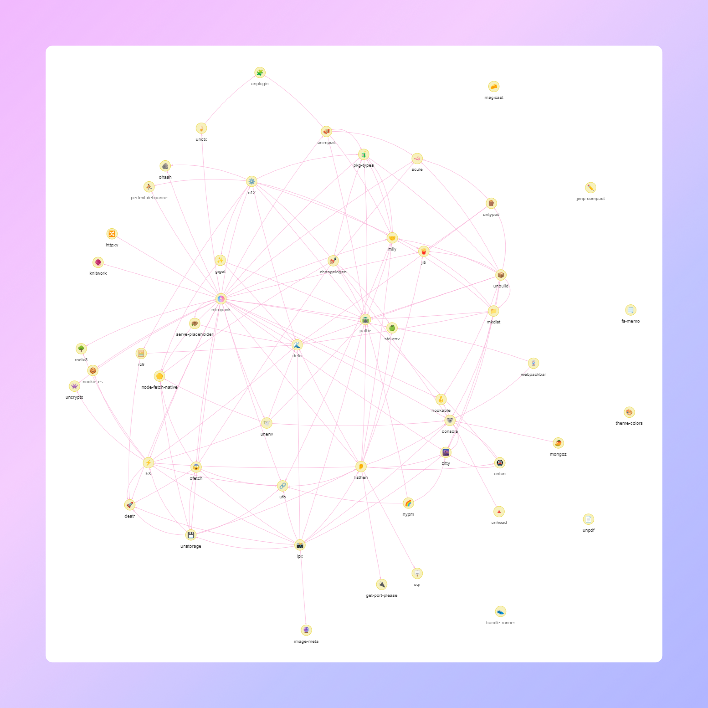

# Relations UnJS

[](https://github.com/antfu/eslint-config)

Discover UnJS ecosystem from a new angle! 🔭

- 🪄 Visualize dependencies from UnJS packages
- 🎨 Add any npm package to the graph
- 📦 Add packages from a GitHub repository or organization
- 👶 Print children UnJS dependencies
- 🌙 Enable dark mode

[👉 Check it out](https://unjs-relations.barbapapazes.dev/)

## Setup

Make sure to install the dependencies:

```bash
pnpm install
```

## Development Server

Start the development server on `http://localhost:3000`:

```bash
pnpm run dev
```

## Production

Build the application for production:

```bash
pnpm run build
```

Locally preview production build:

```bash
pnpm run preview
```
